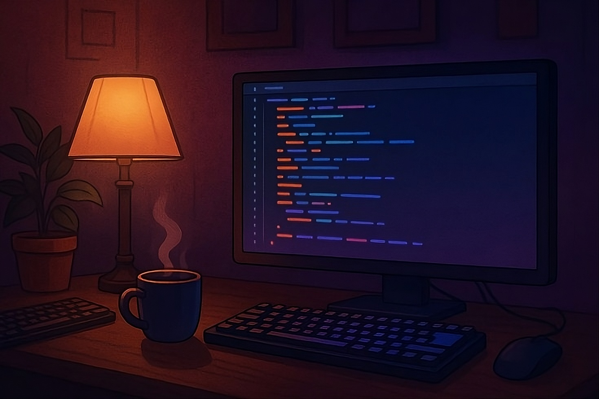

<!--

-->

  

  

  ### About Me ⚡
  <b>
  - 🌱 Currently Pursuing Computer Science Engineering.  
  - 💻 I've strong understanding of Python, Java, Flask, Reactjs, Expressjs, MongoDB, etc.  
  - ⚡ Hobbies: Piano, Photography, Football, gaming, etc  
  </b>

 
 

  

<!---->

# 🌐 Reach me out via:

# 📊 GitHub Stats:

<!--
 

 

-->
<!--
 

-->

# 🎖️ My Badges:

  
  
  
  
  
  
  
  
  &nbsp;
  
  
  
  
  
  
  

 
<!--

-->

# 💻 Tech Stack:

                                           

<!--

 
# 📊 GitHub Stats:

  
   &nbsp;&nbsp;&nbsp;
  

  
  

  

## 🏆 GitHub Trophies

  

-->

# 🔥 2025 Wrapped

    
    

<!--

  &nbsp;&nbsp;&nbsp;&nbsp;
  
  &nbsp;&nbsp;&nbsp;&nbsp;
  

 
-->
 

<!--  -->
<!-- 

  

  -->

  <picture>
    <source media="(prefers-color-scheme: dark)" srcset="https://raw.githubusercontent.com/SamXop123/SamXop123/output/github-snake-dark.svg" />
    <source media="(prefers-color-scheme: light)" srcset="https://raw.githubusercontent.com/SamXop123/SamXop123/output/github-snake.svg" />
    
  </picture>
 

 

 <!-- 
   -->

