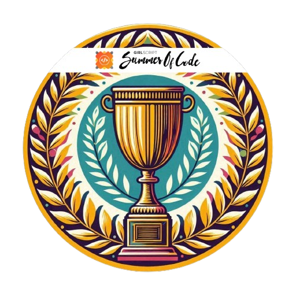
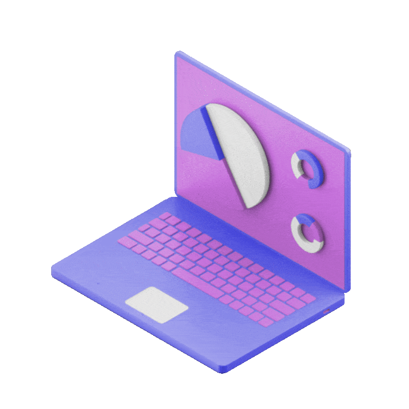

## Hi there 👋

  

  <b>
  - 🔭 I’m currently a 2nd-year B-Tech Student at VIT.  
  - 🌱 Pursuing Computer Science Engineering  
  - 👯 Specialisation AI & ML  
  - 💻 I've foundational understanding of Python, Java, Flask, Javascript, Web Dev, etc.  
  - ⚡ Hobbies: Piano, Photography, Football, etc  
  - ✨ Lifelong learner, code enthusiast, and a dream weaver.
  </b>

## My Badges 😊

  
  
  
  
  
  
  
  
  &nbsp;
  
  
  
  

 

## 🌐 Reach me out via:
   

# 💻 Tech Stack:

# 📊 GitHub Stats:

  
   &nbsp;&nbsp;&nbsp;
  

  
  

<!-- 
to rem Comment 
   -->

<!-- ## 🏆 GitHub Trophies -->

  
   
  
  

  &nbsp;&nbsp;&nbsp;&nbsp;
  
  &nbsp;&nbsp;&nbsp;&nbsp;
  
  

 
 

<!--  -->
<!-- 

  

  -->

  <picture>
    <source media="(prefers-color-scheme: dark)" srcset="https://raw.githubusercontent.com/SamXop123/SamXop123/output/github-snake-dark.svg" />
    <source media="(prefers-color-scheme: light)" srcset="https://raw.githubusercontent.com/SamXop123/SamXop123/output/github-snake.svg" />
    
  </picture>
 

 

 <!-- 
   -->

